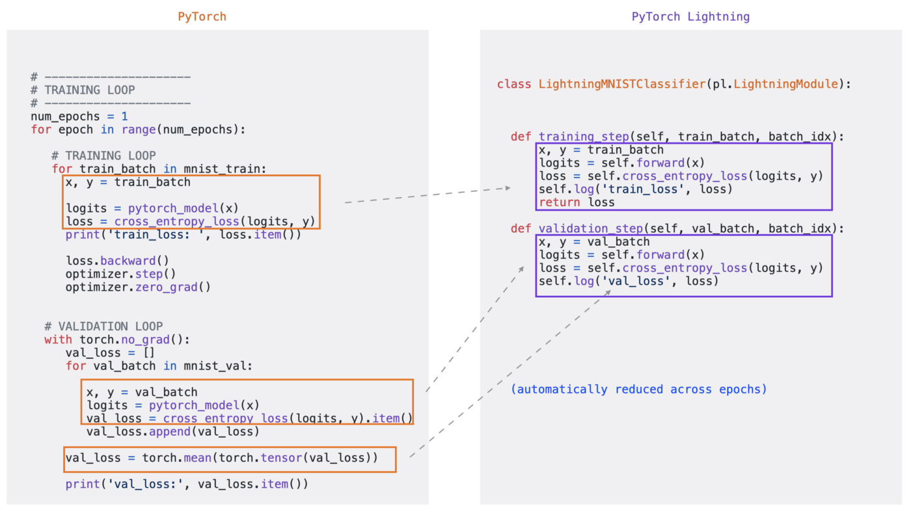

# Pytorch Lightning

이제 Level2에 접어들면서 제법 PyTorch로 코드를 짜는 경험들을 많이 해보셨을텐데요, PyTorch 코드가 생각보다 정형화되어 있다는 것을 알 수 있을 것입니다. 전체적인 파이프라인을 돌이켜보면
+ DataLoader 구성
+ Model 구성
+ Backpropagation + weight update
+ 전체 코드 실행하는 스크립트

정도로 정리할 수 있습니다. 처음 공부할 때 몇 번은 이걸 밑바닥부터 짜는 게 재밌지만, 프로젝트를 진행할수록 이 코드를 다시 짜는 게 여간 일이 아닐 수가 없습니다. Task가 조금 바뀌거나 데이터가 변경되면 바꿔줘야할 코드가 많기 때문에 이전에 사용된 코드를 재사용하는 것도 어렵습니다. 이런 귀찮은 과정들을 어느 정도 정형화해둔 PyTorch code template (혹은 boilerplate)들이 많이 존재하는데요, 여기 위에 코드를 짜도 고려해야될 부분들이 있습니다. 예를 들어 mixed precision이나 multi-gpu 환경에 맞춰서 코드를 짜야할 부분들은 boilerplate가 있어도 여간 귀찮은 작업이 아닐 수 없습니다. 또한 중간중간 모델을 저장하는 부분들이나 gradient accumulation 같이 사소하지만 귀찮은 부분들 또한 구성해야하는 데 이 또한 귀찮습니다. 이 모든 부분을 간편하게 사용할 수 있도록 구현해준 라이브러리가 있는데요, 바로 [**PyTorch Lightning**](https://www.pytorchlightning.ai/)입니다. 해당 라이브러리가 광고(?)하는 코드를 살펴보면 생각보다 간단한 `pytorch_lightning.LightningModule`로 한 번에 많은 부분들을 해결하는 것을 볼 수 있는데요, 저희 DKT에도 한 번 적용해보면 좋을 것 같습니다.

## 기본적인 사용법

혹시 `scikit-learn`을 사용해보신 적이 있나요? `scikit-learn`은 굉장히 많은 머신러닝 모델들을 포함하고 있는데요, 사용법이 굉장히 간단합니다. 몇 줄만으로 모델을 정의하고 fitting까지 마무리한 후에 테스트 데이터에 대해 추론하는 것까지 단 몇 줄이면 가능합니다. 물론 이는 모델의 구조나 모델을 훈련하는 방식이 정형화 되어 있기 때문에 아래처럼 쉽게 짤 수 있는 구조인데요, pytorch 모델도 이렇게 쉽게 짜면 굉장히 편할 것 같습니다.
```python
from sklearn.ensemble import RandomForestClassifier

cls = RandomForestClassifier()
cls.fit(X, y)
cls.predict(X_test)
```

위의 `scikit-learn` 구조를 보면, 모델을 정의하고, `.fit` 메소드를 통해 학습시킨 후, `.predict` 메소드로 추론까지 마무리할 수 있습니다. PyTorch Lightning도 비슷한 구조를 지향하고 있는데요, 라이트닝의 메인홈페이지에 나오는 구조를 보시면 알 수 있습니다. 아래는 다른 소개예시에 나온 코드인데요.



살펴보면, pytorchlightning을 통한 model class하나를 생성해서, 해당 클래스 내부에 훈련과 추론하는 코드를 작성하면, 그 외의 부분은 lightning 내부에서 자동으로 처리해주는 구조입니다. 그 후 trainer를 정의하여 방금 정의한 모델과 사용자가 필요한 DataLoader를 넣어서 `.fit`만 해주면 간단해집니다.

```python
    from args import parse_args
    from dkt.dataloader import Preprocess, get_loaders
    import math

    args = parse_args()

    # 01. Make Dataloader
    preprocess = Preprocess(args)
    preprocess.load_train_data(args.file_name)
    train_data = preprocess.get_train_data()
    train_data, valid_data = preprocess.split_data(train_data)
    train_loader, valid_loader = get_loaders(args, train_data, valid_data)

    # 02. Define model
    model = DktLightning(args)

    # 03. Define Trainer
    trainer = pl.Trainer(gpus=1, precision=16)
    trainer.fit(model, train_loader, valid_loader)
```

그렇다면 모델은 어떻게 구성해줘야할까요? 이걸 자세하게 구성해주는 방식은 많은데, 가장 간단한 방식은 **batch 단위 행동을 정의**해주면 됩니다. batch 단위의 행동이란, dataloader에 대해 for loop를 돌릴 때 내부에서 정의되는 동장입니다. 이를 `*_step`이라는 메소드를 오버라이드하여 사용할 수 있습니다. 다음과 같이 사용할 수 있습니다. 바로 아래와 같이요
```python
    def training_step(self, train_batch, batch_idx):
        
        input = process_batch(train_batch)
        preds = self.forward(input)
        targets = input[3]

        preds = preds[:, -1]
        targets = targets[:, -1]
        loss = compute_loss(preds, targets)
        self.accuracy(preds, targets.int())
        self.auroc(preds, targets.int())

        self.log("train_loss", loss, on_epoch=True)
        self.log("train_acc", self.accuracy)
        self.log("train_acc", self.auroc)
        return loss
```
자세히 살펴보면 현재 dkt.dkt.trainer 내부에서 사용되는 코드와 동일합니다. 다만 여기서 `update_params`를 진행하지 않았는데 놀랍게도 `training_step`에서 반환된 값을 통해 모델을 업데이트해주기 때문에, 귀찮은 `optimizer.step()`, `optimizer.zero_grad()`를 적어주지 않아도 됩니다. 코드의 양이 줄어든다는 것은 단순히 가독성을 위함이 아니라, 사용자가 만들어낼 수 있는 에러들의 경우의 수를 낮춰주는 좋은 역할도 있습니다. 하지만 이렇게 래핑된 라이브러리들은 디버깅을 할 때 생각보다 애를 먹을 수 있습니다. 내가 생각한 로직이 내부에서 의도한대로 돌아가지 않는 경우들이 있기 때문에 이를 언제나 고려해야합니다.

추가로 `self.log`라는 메소드를 확인할 수 있는데요. 이는 로깅을 해줍니다. 어디다 로깅을 하는지는 trainer에서 정의할 때 정해줄 수 있습니다. Callback과 같은 기능들로 wandb와 같이 외부 라이브러리에 기록하는 것 또한 가능합니다. (하단에 Loggers 항목 참고)

더 좋은 기능 중에 하나는, 라이트닝에서 만든 `torchmetrics`라는 라이브러리를 쉽게 활용할 수 있다는 점인데요, trainer 내부에서 accuracy를 정의해주면 굉장히 쉽게 위에 보여지는 예제코드블록처럼 쉽게 사용할 수 있습니다. 이것이 편한 이유는, accuracy, auroc와 같이 batch 단위 결과가 아닌, 전체 batch 결과를 모아서 확인해야하는 지표들의 경우, 매번 prediction과 target을 list에 다 모아서 마지막에 별도로 계산해줘야 하는 귀찮음과, pytorch 자체에서 accuracy나 auroc를 제공하지 않기 때문에 직접 만들어서 쓰거나 `scikit-learn`에서 제공하는 함수들을 이용해야 한다는 귀찮음이 존재하는데, 이를 한 번에 편하게 처리했다는 장점이 있습니다.

전체 예제 코드는 따로 확인할 수 있습니다. 예제코드는 code/dkt 안에 넣으면 바로 활용이 가능합니다. lightgcn에서도 사용해보세요!


## 그 외 유용한 기능들

### Trainer Arguments

제일 좋은 건 PyTorch lightning의 [공식 documentation](https://pytorch-lightning.readthedocs.io/en/stable/api/pytorch_lightning.trainer.trainer.Trainer.html#pytorch_lightning.trainer.trainer.Trainer)을 확인해보는 것입니다. 그 중 몇 가지를 살펴보면
+ `gradient_clip_val` Gradient clipping을 걸어줄 수 있습니다. 저희 코드 내부에서는 `torch.nn.utils.clip_grad_norm_`으로 직접 구현해서 넣었는데, 이런 값들 또한 trainer가 조정해줄 수 있습니다. `gradient_clip_algorithm` 또한 설정가능합니다.
+ `accumulate_grad_batches` Gradient accumulation을 별도로 구현하지 않고 이를 간편하게 argument로 조정할 수 있습니다.
+ `auto_lr_find` 자동으로 학습에 좋은 learning rate를 찾아주는 플래그입니다. 절대 최고 성능값을 보장하지는 않구요, 초기에 적절한 learning rate값을 찾는 데 도움이 될 수 있습니다.
+ `fast_dev_run` 종종 디버깅을 하고 싶은데 데이터가 너무 많아서 한세월 걸리는 경우들이 있습니다. 이럴 때 전체 데이터를 살펴보지 않고 일부 데이터만 살펴보도록 정해줄 수 있는 방법입니다.
+ `resume_from_checkpoint` 저장한 체크포인트를 다시 불러와서 학습할 때 쓸 수 있습니다. 이 또한 구현하는 것이 생각보다 귀찮은데 간편하게 사용할 수 있습니다.
+ `precision` Mixed precision을 구현하게 해줍니다. 매번 불러와서 쓰는 것이 귀찮은데 이 또한 쉽게 쓸 수 있습니다.


### Callbacks

콜백함수는 간단하게 설명하면 train step이나 validate step 전후에 추가적인 기능을 수행하고 싶을 때 사용할 수 있습니다. 간단하게 예를 들어보면, 모델 체크포인트를 저장하는 [ModelCheckpoint](https://pytorch-lightning.readthedocs.io/en/stable/api/pytorch_lightning.callbacks.ModelCheckpoint.html) 콜백함수가 있는데요, 이를 사용하면 특정 epoch이나 step 전후에 언제 모델을 저장할지 정해줄 수 있습니다.

[EarlyStopping](https://pytorch-lightning.readthedocs.io/en/stable/common/early_stopping.html) 또한 콜백함수를 통해 쉽게 걸어줄 수 있습니다.

### Loggers

Metric들을 더 쉽게 시각화해주는 라이브러리들이 많습니다. MLflow나 Wandb 같은 것들이 그 예인데, 방금 예제에서 살펴본 `self.log`를 라이트닝이 지원하는 사용자가 원하는 라이브러리에 기록하는 것이 가능합니다. [공식 documentation 참고](https://pytorch-lightning.readthedocs.io/en/stable/extensions/logging.html)


## 마치며

PyTorch Lightning은 생각보다 회사에서도 간단하게 mock-up을 실행해봐야할 때 종종 쓰이는 라이브러리입니다. 과거 0.x 버전에는 잔 버그가 너무 많아서 사실 테스트하는 과정에서 에러 수정하는 일이 더 잦았기 때문에 많이 쓰이지 않았지만, 현재 1.7+ 버전까지 등장한 이후로는 에러가 많이 줄어서 사용하기 굉장히 간편한 라이브러리입니다. 하지만 몇 가지 단점이 있는데, 그 중 하나가 multi-gpu 환경에서 ddp가 제대로 작동하지 않는 이슈입니다. 실제로 Pytorch Lightning github에 방문해보면 Issue에서 comment 기준으로 sort 해봤을 때 상위에 DDP 관련된 이슈가 많은 것을 확인할 수 있습니다. 간단하게 테스트해보고, 해당 태스크가 자세히 실험해보거나 더 큰 스케일로 올려서 실험해봐야 한다고 판단이 되면, 직접 trainer를 짜거나 dependency 없이 짜는 것을 추천드립니다.
