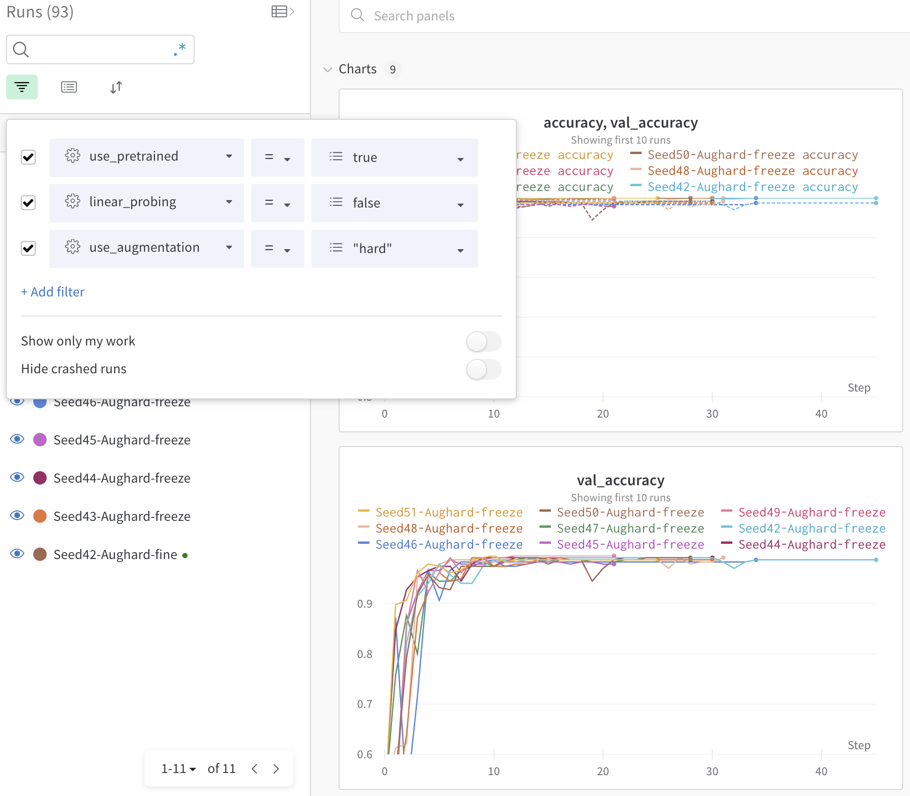
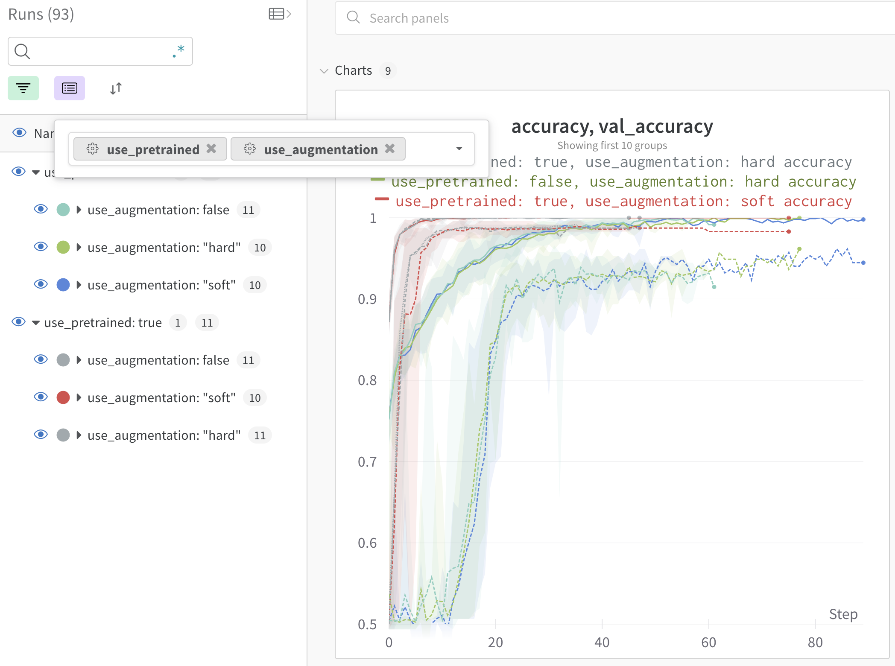
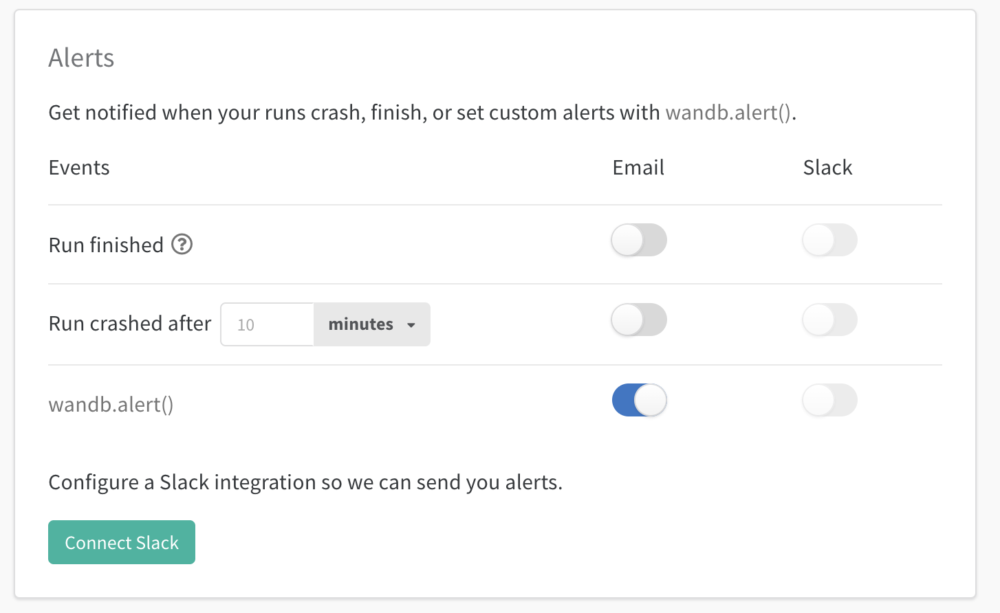

# Hyperparameter Optimization

최적의 매개변수를 찾아주는 것이 어떻게 보면 딥러닝 학습의 최종적인 목표라고 볼 수 있는데요, 이를 찾는 과정을 한 번 떠올려봅시다. 가령 학습률과 스케줄러 두 개에 대해 각각 5개의 값을 다 테스트해보고 싶다고 생각해봅시다.

총 5*5개=25개의 조합을 살펴봐야 하는데 이를 어떻게 돌려봐야할까요? 보통은 bash shell script를 하나 생성해서 돌리면 쉽게 정리할 수 있지만... 이들 중 어떤 결과가 가장 좋았는지, 결과값들을 모아서 분석하는 것이 생각보다 쉽지 않은 것을 알 수 있습니다. 실험을 보다 쉽게 실행시키고 이 결과들을 비교할 수 있도록 돕는 라이브러리들이 많이 있는데, 오늘은 그 중 저희 베이스라인에도 들어가있는 `wandb`의 **Sweep** 기능에 대해 알아보려고 합니다.


## Wandb

### 기본적인 사용법

Wandb의 sweep을 알기 전에 wandb를 조금은 알아야겠죠. Wandb는 여러 실험들을 기록하고 비교하는 데 도움을 줄 수 있는 툴입니다. 직접 기록한 메트릭들을 쉽게 비교하고 보고 싶은 실험들을 그룹핑하는 게 간단하게 GUI로 작업할 수 있다는 것이 큰 장점인데요, 많이 알고 쓰는 것이 이득인 툴입니다. 제가 중요하게 생각하는 몇 가지 기능을 소개하면

+ **Filter**: 실험을 많이 돌리다보면 우숩게 실험개수가 100~200개씩 오가는 것을 볼 수 있는데요, 결과들을 .csv로 저장해두고 필요한 것만 골라서 볼 수 있지만... GUI로 보고 싶은 실험들을 얻어내는 것이 훨씬 쉬울 것 같네요. Filter를 이용하면 특정 설정값을 사용한 결과들만 보거나, 연속형 설정값의 경우 범위 또한 설정해줄 수 있기 때문에 굉장히 편리한 기능입니다.

+ **Group**: 하나의 설정값에 대해 여러 개의 난수를 돌려보거나, 고정된 설정값 하나에 대한 동향을 보고싶은 경우가 있을 수 있는데요, 이를 matplotlib으로 하나하나 그려보면 정말 피곤합니다. 이를 쉽게 grouping 기능을 통해 확인할 수 있습니다. 그래프에 그려진 shade를 통해 해당 설정값의 deviation을 알 수 있습니다.

+ **Alarm**: 모델을 CLI환경에서 돌려놓고 나면 어떻게 돌아가고 있는지 상황을 연락 받고 싶을 때가 있습니다. wandb에 직접 들어가서 현황을 확인할 수 있지만, wandb는 슬랙과 연동할 수 있는 기능이 있습니다.


wandb의 기본적인 사용법은 아래와 같습니다. 기본적으로 하나의 프로젝트 내부에 여러 실험을 쌓는 구조이기 때문에 처음에 어떤 프로젝트에 넣을 것인지 확인해줘야 합니다. 자세한 내용은 [공식 documentation](https://docs.wandb.ai/ref/python/init)을 확인해주세요.
```python
import wandb

wandb.login()
wandb.init(
    project="dkt", # 어떤 프로젝트에 넣어줄지
    config=config, # Key-value 형태로 설정값을 넣어줄 수 있습니다. 실험 중에 업데이트도 가능합니다.
    name=run_name, # 프로젝트 내에서 실험의 이름으로, 별도로 설정해주지 않으면 임의의 이름이 생성됩니다.
)

# 실험 중 기록
# 마찬가지로 key-value 형태로 기록해야할 값을 넣습니다.
# 한 번 로그를 넣을 때 하나의 스텝으로 인식하기 때문에, 한 스텝에 넣을 매개변수가 추가로 있다면, commit=False 인자를 넣어주세요.
wandb.log({
    "epoch": epoch,
    "train_loss": train_loss,
})
```

### Sweep
모델 훈련이 다음과 같이 예시로 CLI를 통해 설정값을 변경할 수 있는 상태여야 합니다. 현재 dkt/dkt code를 예시로 가져와 보았는데요.
```bash
python train.py --lr=1e-3 --drop_out=0.2
```
위와 같이 두 개의 다른 설정값을 변경 시켰을 때 어떤 결과가 최고의 성능을 가져오는지 sweep을 통해 확인해봅시다. 동일한 경로 내에 `sweep.yaml` 파일을 아래와 같이 생성해봅시다. `.yaml` 문법은 굉장히 간단하고 hydra에서도 확인해보았으니 쉽게 작성하실 수 있을 것입니다.

```yaml
program: train.py # 작업할 파이썬 스크립트 이름
method: bayes # 매개변수를 찾는 방식
metric: # 어떤 메트릭을 기준으로 좋은 실험을 찾을지
  name: val_loss
  goal: minimize
parameters: # 변경하고 싶은 parameters
  lr:
    # 범주형의 경우 실험하고 싶은 값들을 리스트로 넣어줍니다.
    # 연속형이더라도 실험하고 싶은 값들이 정해져있다면 리스트로 넣어줍니다.
    values: [1e-2, 1e-3, 1e-4]
  drop_out:
    # 연속형의 경우 최대/최소값을 기입해주면 그 범위 안에서 값을 적절히 선택하여 실험을 진행합니다.
    min: 0.0
    max: 0.5
```

그 후 CLI에서 다음 두 줄을 통해 실험을 진행할 수 있는데요
```bash
wandb sweep sweep.yaml
wandb agent (entity)/(project)/(sweep_id)
```
이렇게 쉽게 sweep을 사용해보았습니다. 언제나 그렇듯 더 자세한 내용은 [공식 Documentation](https://docs.wandb.ai/v/ko/sweeps)을 확인해보는 것을 권장합니다. wandb는 친절하게 한글로 된 문서가 있기 때문에 조금 더 쉽게 확인이 가능하지만, 일부 문서들은 영어로만 존재할 수 있습니다. 예제 코드로 `03_sweep.yaml`을 작성해두었습니다. 여기서 wandb agent 뒤에 들어가는 인자를 정리하면
+ entity: 계정 혹은 팀이름이 들어가면 됩니다.
+ project: project 이름을 넣어주면 됩니다.
+ sweep_id: 이것은 `wandb sweep sweep.yaml` 파일을 생성하고 난 후 CLI에서 보이는 sweep_id를 넣어야 합니다.
저의 경우는 아이디가 1pha, project는 dkt, 위에서 `wandb sweep sweep.yaml`를 수행한 후 얻은 sweep_id인 `sb7f74vh`를 넣어서 `wandb agent 1pha/dkt/sb7f74vh`를 입력하면 sweep이 돌아갑니다. 위와 같이 CLI로 진행하는 것이 어렵다면 파이썬 스크립트에서 다음과 같이 작성할 수 있습니다.

```python
sweep_id = wandb.sweep(sweep_config) # 여기서 sweep_config는 위에서 만든 sweep.yaml 파일과 똑같은 내용을 dict 형태로 넣어주면 됩니다.
wandb.agent(sweep_id)
```


## 마치며

이렇게 여러 매개변수들을 돌려서 학습해보고 최적화된 결과물을 찾는 행위들을 줄여서 HPO(hyperparameter optimization)이라고 부릅니다. 실제로 [위키](https://en.wikipedia.org/wiki/Hyperparameter_optimization)에 가보면 이에 대한 라이브러리들이 생각보다 많다는 것을 알 수 있는데요, 다른 툴 중에 내가 현재 사용하기에 더 적합한 것이 있는지 찾아보는 것도 재미있을 것 같네요. 